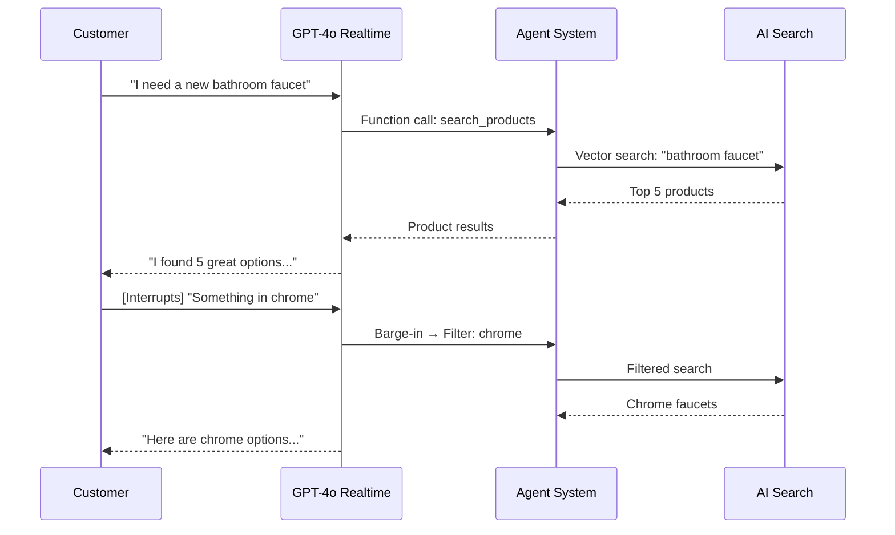
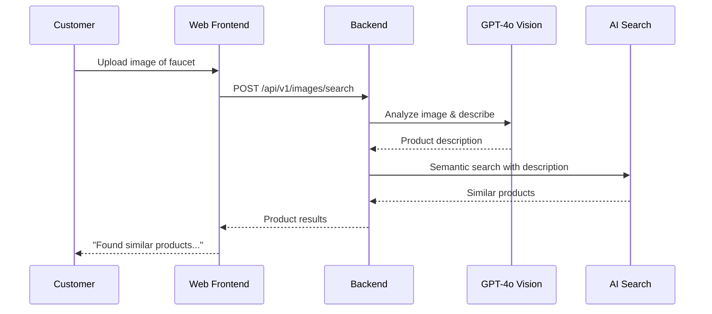

# 🏠 KetzAgenticEcomm - AI-Powered Home Improvement Voice Assistant

> **Enterprise-grade voice commerce platform** powered by GPT-4o Realtime API, Azure AI Search, and multi-agent orchestration. Features **350+ home improvement products** with visual search capabilities.


## ✨ Features

### 🎤 Voice-First Experience
- **GPT-4o Realtime API** - Native voice-to-voice with ultra-low latency
- **Built-in Barge-in** - Natural interruption handling
- **ACS Integration** - Phone (PSTN) and web voice support
- **Multi-language** - English primary, extensible

### 🖼️ Visual Search
- **Image Upload** - Find products by uploading photos
- **GPT-4o Vision** - AI-powered image analysis for product identification
- **Semantic Search** - "Find products like this image"
- **Combined Search** - Voice + image for precise results

### 🤖 Multi-Agent System
| Agent | Responsibility |
|-------|----------------|
| **Shopping Concierge** | Product discovery, recommendations, comparisons |
| **Order Processing** | New orders, tracking, modifications |
| **Returns & Support** | Returns, exchanges, complaints |
| **Product Expert** | Technical specs, compatibility, installation help |

### 🔍 Intelligent Search
- **Azure AI Search** - Full-text + vector search
- **Semantic Ranking** - Understanding intent, not just keywords
- **Image Vectors** - Find visually similar products
- **Faceted Filtering** - Category, price, brand, ratings

### 🎬 YouTube DIY Videos
- **YouTube Data API v3** - Real-time search for DIY tutorial videos
- **Smart Suggestions** - Automatically shows relevant tutorials when searching for installable products
- **High-View Priority** - Prioritizes popular, highly-viewed videos for quality content
- **Dismissible UI** - Videos appear in chat panel with easy dismiss option
- **Product Categories** - Optimized for HVAC filters, flooring, plumbing, electrical, paint, and more

## 🏗️ Architecture

```
┌─────────────────────────────────────────────────────────────────────────┐
│                    CUSTOMER (Phone or Web Browser)                       │
└─────────────────────────────────────────────────────────────────────────┘
                                    │
                    ┌───────────────┴───────────────┐
                    │                               │
                    ▼                               ▼
        ┌───────────────────┐           ┌───────────────────┐
        │  Azure Comm Svc   │           │   Web Frontend    │
        │  (Phone/PSTN)     │           │   (React + Vite)  │
        └───────────────────┘           └───────────────────┘
                    │                               │
                    └───────────────┬───────────────┘
                                    ▼
┌─────────────────────────────────────────────────────────────────────────┐
│                        FastAPI Backend                                   │
│  ┌─────────────────────────────────────────────────────────────────┐   │
│  │                    GPT-4o Realtime API                           │   │
│  │  • Native voice-to-voice    • Built-in barge-in                 │   │
│  │  • Function calling         • WebSocket streaming               │   │
│  └─────────────────────────────────────────────────────────────────┘   │
│  ┌─────────────────────────────────────────────────────────────────┐   │
│  │                    GPT-4o Vision                                 │   │
│  │  • Image analysis           • Product identification            │   │
│  └─────────────────────────────────────────────────────────────────┘   │
│                                    │                                     │
│  ┌─────────────────────────────────┴─────────────────────────────┐     │
│  │                    Multi-Agent Orchestration                    │     │
│  │  ┌──────────────┐ ┌──────────────┐ ┌──────────────┐           │     │
│  │  │  Shopping    │ │   Orders     │ │   Returns    │           │     │
│  │  │  Concierge   │ │   Agent      │ │   Agent      │           │     │
│  │  └──────────────┘ └──────────────┘ └──────────────┘           │     │
│  └───────────────────────────────────────────────────────────────┘     │
└─────────────────────────────────────────────────────────────────────────┘
                                    │
        ┌───────────────────────────┼───────────────────────────┐
        ▼                           ▼                           ▼
┌───────────────┐         ┌───────────────┐         ┌───────────────┐
│  Azure AI     │         │   Cosmos DB   │         │ Blob Storage  │
│  Search       │         │  (MongoDB)    │         │  (Images)     │
│  • Semantic   │         │  • Orders     │         │  • Product    │
│  • Full-text  │         │  • Carts      │         │    photos     │
│  • Filters    │         │  • Returns    │         │  • Uploads    │
└───────────────┘         └───────────────┘         └───────────────┘
```

## 🚀 Quick Start

### Prerequisites
- Azure subscription
- Azure Developer CLI (`azd`)
- Python 3.11+
- Node.js 18+
- Docker (for local development)

### Deploy to Azure

```bash
# Clone and navigate
cd KetzAgenticEcomm

# Login to Azure
azd auth login

# Deploy everything (~20 minutes)
azd up

# Seed products with images
python scripts/seed_products.py
```

### Deploy with Terraform

```bash
# Navigate to Terraform directory
cd infra/terraform

# Initialize Terraform
terraform init

# Review the deployment plan
terraform plan

# Deploy infrastructure (~15-20 minutes)
terraform apply

# Note: After deployment, you need to:
# 1. Create GPT-4o-realtime deployment manually in Azure OpenAI Studio
# 2. Build and push container images to ACR
# 3. Seed product data
```

**Infrastructure Created by Terraform:**
- Virtual Network with Container Apps and Private Endpoint subnets
- Cosmos DB (MongoDB API) with private endpoint
- Azure AI Search (Standard tier with semantic search)
- Azure OpenAI (GPT-4o + GPT-4o Realtime + text-embedding-3-large)
- Container Apps Environment with VNet integration
- Backend & Frontend Container Apps
- Blob Storage for product images
- Key Vault for secrets
- Application Insights for monitoring

### Local Development

```bash
# Backend
cd backend
python -m venv .venv
.venv\Scripts\activate  # Windows
pip install -r requirements.txt
uvicorn main:app --reload --port 8000

# Frontend (new terminal)
cd frontend
npm install
npm run dev
```

## 📁 Project Structure

```
KetzAgenticEcomm/
├── backend/                    # FastAPI + Python
│   ├── api/                    # API endpoints
│   │   ├── v1/
│   │   │   ├── realtime.py     # GPT-4o Realtime WebSocket
│   │   │   ├── search.py       # Product search endpoints
│   │   │   ├── images.py       # Image upload & search
│   │   │   └── orders.py       # Order management
│   │   └── dependencies.py
│   ├── agents/                 # Multi-agent system
│   │   ├── shopping_concierge/
│   │   ├── orders_agent/
│   │   ├── returns_agent/
│   │   └── product_expert/
│   ├── services/               # Azure integrations
│   │   ├── realtime_client.py  # GPT-4o Realtime
│   │   ├── ai_search.py        # Azure AI Search
│   │   ├── vision.py           # Azure AI Vision
│   │   ├── cosmos.py           # Cosmos DB
│   │   ├── blob.py             # Blob Storage
│   │   └── youtube_service.py  # YouTube DIY Videos API
│   ├── tools/                  # Agent tools
│   │   ├── product_tools.py    # Product search tools
│   │   ├── order_tools.py      # Order management tools
│   │   ├── return_tools.py     # Return processing tools
│   │   └── youtube_tools.py    # YouTube DIY video search
│   ├── config/
│   │   └── settings.py
│   ├── main.py
│   └── requirements.txt
├── frontend/                   # React + Vite
│   ├── src/
│   │   ├── components/
│   │   │   ├── VoiceChat.jsx
│   │   │   ├── ImageUpload.jsx
│   │   │   ├── ProductGrid.jsx
│   │   │   └── ProductCard.jsx
│   │   ├── hooks/
│   │   │   ├── useRealtime.js
│   │   │   └── useImageSearch.js
│   │   ├── App.jsx
│   │   └── main.jsx
│   └── package.json
├── infra/                      # Infrastructure as Code
│   └── terraform/
│       ├── main.tf
│       ├── variables.tf
│       ├── outputs.tf
│       └── modules/
├── scripts/                    # Utility scripts
│   ├── seed_products.py        # Seed 300+ products
│   ├── index_images.py         # Generate image embeddings
│   └── setup_search.py         # Create AI Search index
├── azure.yaml                  # Azure Developer CLI
├── docker-compose.yml
└── README.md
```

## � Component Deep Dive

### Azure Services

#### 1. Azure OpenAI Service
| Deployment | Purpose |
|------------|---------|
| `gpt-4o-realtime-preview` | **Voice conversations** - Powers real-time voice assistant with WebSocket streaming |
| `gpt-4o` | **Image analysis** - Analyzes uploaded images to generate product descriptions for search |
| `text-embedding-3-large` | **Text embeddings** - Generates semantic embeddings for product search |

**Flow:** User speaks → Audio streams to GPT-4o Realtime → AI responds with voice + triggers tools

#### 2. Azure AI Search
| Feature | Usage |
|---------|-------|
| **Semantic Search** | Understands intent - "something to cut wood" finds saws |
| **Full-text Search** | Keyword matching on product names/descriptions |
| **Filters & Facets** | Filter by category, brand, price range |
| **Vector Search** | Index has vector fields for future image/text embeddings |

**Index:** `products` with 100 home improvement products (tools, plumbing, electrical, etc.)

#### 3. Azure Cosmos DB
| Collection | Data Stored |
|------------|-------------|
| `orders` | Customer orders with items, totals, status |
| `carts` | Shopping cart state per session |
| `returns` | Return requests and refund status |

**API:** MongoDB-compatible for easy querying

#### 4. Azure Blob Storage
| Container | Contents |
|-----------|----------|
| `product-images` | Product images (served via proxy) |
| `uploads` | User-uploaded images for search |

#### 5. Azure Container Apps
| App | Image | Purpose |
|-----|-------|---------|
| `backend-vnet` | `backend:v16-cleanup` | FastAPI backend with all APIs |
| `frontend-vnet` | `frontend:v5-fix` | React/Vite frontend UI |

---

### Backend Components

#### API Endpoints (`/api/v1/`)

| Endpoint | Method | Purpose |
|----------|--------|---------|
| `/realtime/session` | GET | Start voice session |
| `/realtime/ws` | WebSocket | Voice assistant connection |
| `/products/` | GET | List/search products |
| `/products/{id}` | GET | Get product details |
| `/products/categories` | GET | Get category list |
| `/images/search` | POST | Upload image → find similar products |
| `/orders/` | POST | Create order |
| `/orders/{id}` | GET | Get order status |
| `/img/proxy` | GET | Proxy external images (CORS fix) |

#### Services (`/services/`)

| Service | File | Purpose |
|---------|------|---------|
| `AISearchService` | `ai_search.py` | Search products, semantic queries, vector search |
| `CosmosDBService` | `cosmos_db.py` | CRUD operations for orders, carts, returns |
| `BlobStorageService` | `blob_storage.py` | Upload/download images |

#### Agents (`/agents/`)

| Agent | Purpose |
|-------|---------|
| `ShoppingConcierge` | Main orchestrator - routes user requests to appropriate agents |
| `OrdersAgent` | Handles order creation, status checks, cancellations |
| `ReturnsAgent` | Processes return requests, refund status |
| `ImageSearchAgent` | Analyzes images and finds similar products using GPT-4o Vision |

#### Tools (`/tools/`)
Functions that the AI can call during voice conversations:

| Tool | Function |
|------|----------|
| `search_products` | Search catalog by query, filters |
| `get_product_details` | Get full product info |
| `add_to_cart` | Add item to shopping cart |
| `view_cart` | Show current cart contents |
| `checkout` | Place order from cart |
| `track_order` | Get order status |
| `search_by_image` | Find products from uploaded image |

---

### Frontend Components

#### Pages & Components

| Component | Purpose |
|-----------|---------|
| `App.tsx` | Main app with routing |
| `VoiceAssistant.tsx` | 🎤 Microphone button, WebSocket to backend |
| `ProductGrid.tsx` | Display product cards in grid |
| `ProductDetail.tsx` | Full product page with add-to-cart |
| `SearchBar.tsx` | Text search + image upload button |
| `ImageSearch.tsx` | Camera icon, file upload, preview |
| `Cart.tsx` | Shopping cart sidebar |
| `OrderHistory.tsx` | Past orders list |

#### State Management
`appStore.ts` (Zustand) manages:
- Products list & search results
- Cart items & totals
- Selected product details
- Voice assistant state
- User session

---

### Data Flow Examples

#### 🎤 Voice Search
```
User speaks "Show me cordless drills"
    ↓
Browser captures audio → WebSocket → Backend
    ↓
GPT-4o Realtime transcribes + understands intent
    ↓
AI calls search_products(query="cordless drills")
    ↓
Azure AI Search returns products (semantic search)
    ↓
AI speaks response + sends product data
    ↓
Frontend displays products in grid
```

#### 📷 Image Search
```
User uploads drill image
    ↓
POST /api/v1/images/search (multipart form)
    ↓
GPT-4o Vision analyzes: "Yellow cordless power drill with battery pack"
    ↓
Semantic search with generated description
    ↓
Azure AI Search returns similar products
    ↓
Frontend displays matching products
```

#### 🛒 Add to Cart (Voice)
```
User: "Add the DeWalt drill to my cart"
    ↓
GPT-4o Realtime understands intent
    ↓
AI calls add_to_cart(product_id="...", quantity=1)
    ↓
Cart updated in Cosmos DB
    ↓
AI: "I've added the DeWalt 20V MAX drill to your cart"
    ↓
Frontend cart updates via WebSocket event
```

## 🛠️ Technology Stack

| Layer | Technology |
|-------|------------|
| **Voice AI** | GPT-4o Realtime API |
| **Image AI** | GPT-4o Vision |
| **Telephony** | Azure Communication Services |
| **Search** | Azure AI Search (semantic + full-text) |
| **Database** | Azure Cosmos DB (MongoDB API) |
| **Storage** | Azure Blob Storage |
| **Backend** | FastAPI (Python 3.11) |
| **Frontend** | React 18 + Vite + TypeScript |
| **Hosting** | Azure Container Apps |
| **IaC** | Terraform |

## 📞 How It Works

### Voice Conversation Flow



### Image Search Flow



## 🔧 Configuration

### Environment Variables

```env
# Azure OpenAI
AZURE_OPENAI_ENDPOINT=https://xxx.openai.azure.com/
AZURE_OPENAI_API_KEY=xxx
AZURE_OPENAI_REALTIME_DEPLOYMENT=gpt-4o-realtime-preview

# Azure AI Search
AZURE_SEARCH_ENDPOINT=https://xxx.search.windows.net
AZURE_SEARCH_KEY=xxx
AZURE_SEARCH_INDEX=products

# Azure Cosmos DB
AZURE_COSMOS_CONNECTION_STRING=mongodb+srv://xxx
AZURE_COSMOS_DATABASE=ketzagenticecomm

# Azure Blob Storage
AZURE_STORAGE_CONNECTION_STRING=xxx
AZURE_STORAGE_CONTAINER=product-images

# Azure Communication Services
ACS_CONNECTION_STRING=xxx
ACS_PHONE_NUMBER=+1xxxxxxxxxx

# YouTube API (for DIY tutorial videos)
YOUTUBE_API_KEY=xxx  # Get from Google Cloud Console
```

## 📊 Product Categories

| Category | Subcategories | ~Products |
|----------|---------------|-----------|
| **Power Tools** | Drills, Saws, Sanders, Routers, Grinders | 50+ |
| **Hand Tools** | Hammers, Screwdrivers, Wrenches, Pliers | 40+ |
| **Building Materials** | Lumber, Drywall, Concrete, Insulation | 30+ |
| **Paint** | Interior, Exterior, Primers, Stains | 35+ |
| **Flooring** | Hardwood, Laminate, Tile, Vinyl, Carpet | 40+ |
| **Plumbing** | Faucets, Toilets, Sinks, Water Heaters | 40+ |
| **Electrical** | Lighting, Outlets, Switches, Smart Home | 35+ |
| **Kitchen & Bath** | Countertops, Cabinets, Vanities | 30+ |
| **Outdoor/Garden** | Grills, Lawn Mowers, Patio Furniture | 35+ |
| **Storage** | Shelving, Garage Storage, Tool Chests | 25+ |
| **Hardware** | Fasteners, Locks, Door Hardware | 25+ |
| **Appliances** | Refrigerators, Washers, Dryers, Ranges | 35+ |

**Total: 350+ Products** with images, ratings, and descriptions

## 📄 License

MIT License - see [LICENSE](LICENSE) for details.

## 🤝 Contributing

See [CONTRIBUTING.md](CONTRIBUTING.md) for guidelines.

---

Built with ❤️ using Azure AI Services
